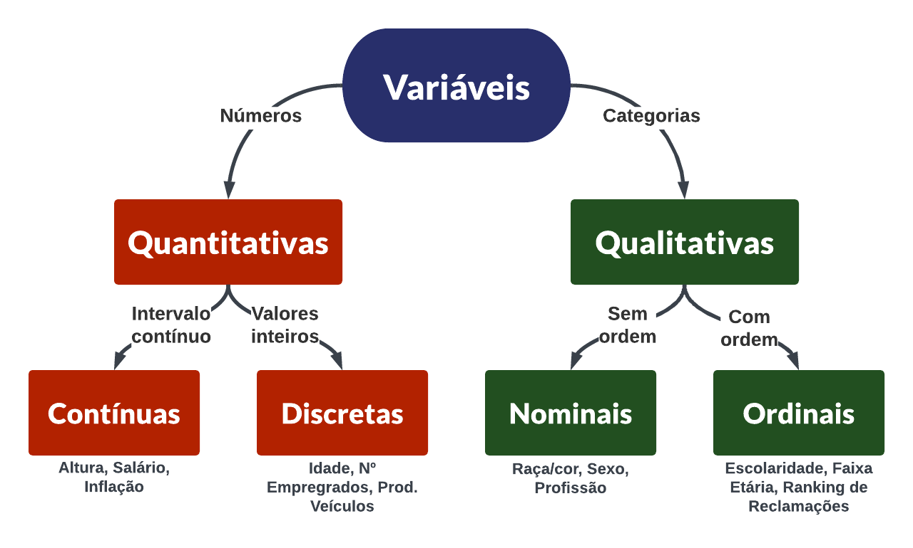

## [Fonte dos dados - IBGE](https://www.ibge.gov.br/estatisticas/sociais/populacao/19897-sintese-de-indicadores-pnad2.html?=&t=microdados)

## Conceitos Estudados Durante a Análise Exploratória

###  Variáveis Quantitativas e Qualitativas

- **uf**             -- > qualitativa   -- > nominais;
- **sexo**           -- > qualitativa   -- > nominais;
- **idade**          -- > quantitativa  -- > discreta;
- **cor**            -- > qualitativa   -- > nominais;
- **anos de estudo** -- > qualitativa   -- > ordinais;
- **renda**          -- > quantitativas -- > continuas;
- **altura**         -- > quantitativas -- > continuas.

### Distribuição de Frequências

- É o conhecimento da base através do comportamento das variáveis envolvidas no estudo. Utilizando técnicas estatísticas como as análises das <b>DISTRIBUIÇÕES DE FREQUÊNCIAS</b> e <b>HISTOGRAMAS</b> podemos avaliar melhor a forma como os fenômenos em estudo se distribuem.

#### Distribuição de Frequências Qualitativas

- **uf** 

- **sexo** 

- **cor** 

- **anos de estudo**

#### Distribuição de Frequências Quantitativas

- **idade** 

- **renda** 

- **altura** 

